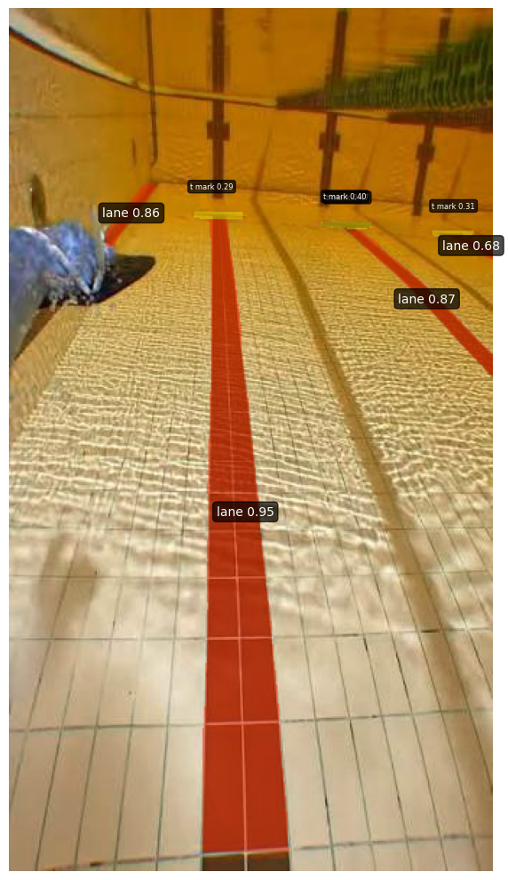

# Swimming Pool Underwater Lane Line Detection

A YOLO26n-seg model fine-tuned to detect swimming pool lane lines and T-marks (wall/turn markers) from underwater and above-water pool footage.

## Motivation

This project is a computer vision experiment exploring how well a lightweight segmentation model can identify pool lane lines and T-marks under real, imperfect pool conditions (glare, water distortion, varying angles). It's an early piece of a larger project I'm building — an assistive device for visually impaired swimmers that relies on spatial awareness of the pool. Camera-based lane detection is being explored as a possible complement to an ultrasonic beacon positioning approach used elsewhere in that project.

This notebook is a standalone experiment, not yet integrated into the full device — it's testing whether the underlying detection problem is tractable before deciding how (or whether) it fits into the final system.

## Approach

- **Model:** YOLO26n-seg (Ultralytics), fine-tuned via transfer learning from the pretrained checkpoint
- **Classes:** `lane` (lane line markings), `t_mark` (T-shaped turn/wall markers)
- **Why segmentation over plain detection:** a bounding box only gives a rough location; a pixel-level mask gives the actual shape and position of the line, which matters more if this is ever used to inform real positioning rather than just "a line is present somewhere here."

## Dataset

- 954 labeled images total — 916 train / 26 validation / 12 test
- Labeled via Roboflow — *[link to be added]*
- Images taken from an above/near-water POV, primarily one pool

**Caveat:** the validation set is small (26 images), so the metrics below should be read as directional rather than precise — they'll have some noise, and a larger validation set would give a more reliable picture.

## Results

| Metric | Bounding Boxes | Segmentation Masks |
|---|---:|---:|
| Precision | 0.903 | 0.914 |
| Recall | 0.614 | 0.615 |
| mAP@0.5 | 0.687 | 0.696 |
| mAP@0.5:0.95 | 0.496 | 0.353 |

**Per class (segmentation):**

| Class | Mask mAP@0.5 | Mask mAP@0.5:0.95 | Mean IoU |
|---|---:|---:|---:|
| lane | 0.794 | 0.412 | 0.706 |
| t_mark | 0.598 | 0.294 | 0.660 |

**Reading these numbers:** precision is high (~91%) — when the model predicts a lane line or T-mark, it's usually correct. Recall is lower (~62%) — it misses a meaningful fraction of lines/marks that are actually present, more often than it produces false positives. `lane` detection is noticeably stronger than `t_mark` detection across every metric, which lines up with what the sample image below shows: high-confidence lane predictions (0.86–0.95) vs. much lower-confidence T-mark predictions (0.29–0.40).

**Sample result:**

| Input | Prediction |
|---|---|
|  |  |

The model correctly picks out all three visible lane lines in this frame, including the two off to the side, not just the center one directly in view. T-mark detection is present but visibly less confident.

## Limitations / Next Steps

- **T-mark detection is weak** relative to lane detection (mAP@0.5 of 0.598 vs 0.794) — likely needs more T-mark examples in the training set, since they're smaller and less visually distinct than the lane lines.
- **Recall is the main bottleneck**, not precision — the model is conservative and misses real lines/marks more than it hallucinates fake ones. Worth investigating whether this is a confidence-threshold issue or a genuine detection gap (e.g. lines at the edge of frame, poor lighting).
- **Small validation set** (26 images) — metrics should be treated as a rough signal, not a precise benchmark.
- **Only tested on still images**, not video — real-world use (whether for the swim assistive device or otherwise) would need to handle a continuous video stream, motion blur, and frame-to-frame consistency.
- **Single pool source** — unclear how well this generalizes to different pools, lane line colors, or lighting setups without more varied training data.

**Next steps:** add more T-mark examples to close the class gap, test on video rather than stills, and evaluate on images from a different pool to check generalization.

## Running it

Open `notebook.ipynb` in Google Colab (GPU runtime recommended — trained on a T4). Main dependency is `ultralytics`, installed in the notebook itself. Requires a Roboflow-exported dataset (`data.yaml` + images) matching the path set in the config cell at the top of the notebook.
