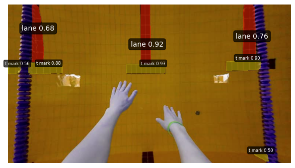
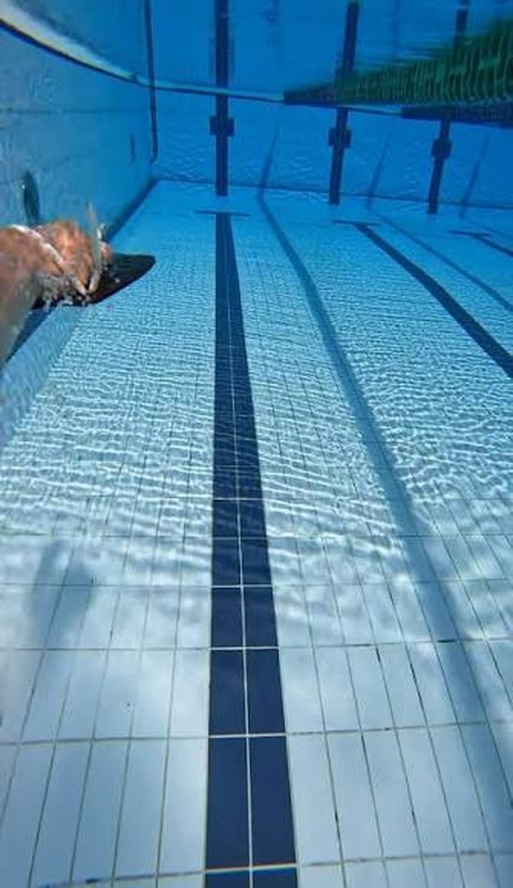
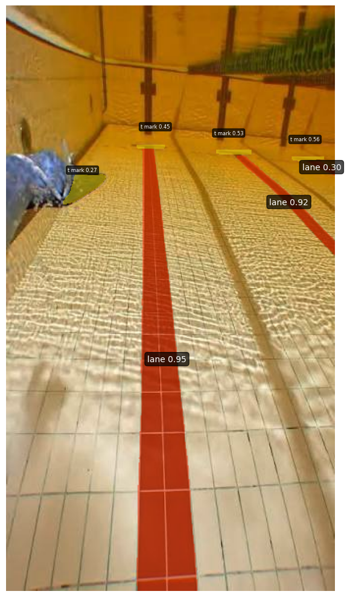

# Swimming Pool Underwater Lane Line Detection : V2

A YOLO26n-seg model fine-tuned to detect swimming pool lane lines and T-marks (wall/turn markers) from underwater pool footage.

## Motivation

This project is a computer vision experiment exploring how well a lightweight segmentation model can identify pool lane lines and T-marks under real, imperfect pool conditions (glare, water distortion, varying angles). It's an early piece of a larger project I'm building - an **assistive device for visually impaired swimmers** that relies on spatial awareness of the pool. Camera-based lane detection is being explored as a possible complement to an ultrasonic positioning approach used elsewhere in that project.

This notebook has not yet been integrated into the full device - it's testing whether the underlying detection problem is tractable before deciding how (or whether) it fits into the final system.

## Approach

- **Model:** YOLO26n-seg (Ultralytics), fine-tuned via transfer learning from the pretrained checkpoint
- **Classes:** `lane` (lane line markings), `t_mark` (T-shaped turn/wall markers)
- **Why segmentation over plain detection:** a bounding box only gives a rough location; a pixel-level mask gives the actual shape and position of the line, which matters more if this is ever used to inform real positioning rather than just presence approximation.

## Dataset

- 1100 labeled images total : 1000 train (91%) / 50 validation (4.5%) / 50 test (4.5%)
- Labeled via Roboflow : *https://universe.roboflow.com/kornranaths-workspace/lanelinedetection*
- Images show pool views, primarily underwater and with lane lines visible

**Preprocessing**

Auto-Orient: Applied

Resize: Stretch to 432x432

**Augmentations**

Outputs per training example: 10

Flip: Horizontal

Rotation: Between -5° and +5°

Shear: ±12° Horizontal, ±11° Vertical

Brightness: Between -20% and +20%

Noise: Up to 0.97% of pixels

Motion Blur: Length 20px, Angle: 0°, Frames: 1

## Results

| Metric | Bounding Boxes | Segmentation Masks |
|---|---:|---:|
| Precision | 0.865 | 0.880 |
| Recall | 0.726 | 0.703 |
| mAP@0.5 | 0.805 | 0.786 |
| mAP@0.5:0.95 | 0.613 | 0.504 |

**Per class (segmentation):**

| Class | Mask mAP@0.5 | Mask mAP@0.5:0.95 | Mean IoU |
|---|---:|---:|---:|
| lane | 0.773 | 0.469 | 0.679 |
| t_mark | 0.798 | 0.539 | 0.713 |

Reading these numbers: precision is high (~88%) - when the model predicts a `lane` or `t_mark`, it's usually correct. Recall is meaningfully better than the previous version (~70%, up from ~62%) - the model now catches a larger share of lines/marks that are actually present. `t_mark` detection has caught up to and now slightly edges out lane on mask mAP@0.5 and Mean IoU, a reversal from earlier versions where lane was clearly stronger. The small dip in lane's Mean IoU (0.706 → 0.679) is within the noise band for a 50-image validation set and isn't consistent across all lane metrics (overall performance of most categories - e.g. mAP@0.5:0.95 - actually improved significantly), so it's best read as minor measurement noise rather than a real regression.

**Sample result:**

| Input | Prediction |
|---|---|
|  |  |

Model correctly picks out all three visible lane lines in this frame, including two off to the side, not just the center one directly in view. Left-most line has also been mistakenly flagged as `lane` (although with visibly less confidence). `t_mark` detection is also present with higher confidence, up ~54% compared to earlier versions.

## Limitations / Next Steps

- **T-mark detection has closed the gap with lane detection** after adding targeted T-mark training examples, it now performs on par with (and slightly ahead of) lane on mask mAP@0.5 (0.798 vs 0.773) and Mean IoU (0.713 vs 0.679). The earlier class imbalance issue appears resolved, though it's worth confirming this holds on a larger validation set.
- **Recall is still the main bottleneck**, though it's improved - up from ~62% to ~70% overall, but the model remains conservative, missing real lines/marks more than it hallucinates fake ones. Still worth investigating whether this is a confidence-threshold tuning issue or a genuine detection gap (e.g. lines at the edge of frame, poor lighting, occlusion by swimmers).
- **Validation set is larger but still modest** (50 images, up from 26) - a meaningful improvement in reliability, but still small enough that per-class metrics (especially the lane/t_mark comparison) should be treated as a reasonable signal rather than a precise benchmark. The small dip in lane Mean IoU is likely within this noise band.
- **Only tested on still images**, not video - real-world use (whether for the swim assistive device or otherwise) would need to handle a continuous video stream, motion blur, and frame-to-frame consistency.

**Next steps:** improve datasplit balance by factoring in instance counts, test on video rather than stills.

## Running it

GPU runtime recommended - trained on a T4. Main dependency is `ultralytics`, installed in the notebook itself. Requires a Roboflow-exported dataset (linked above) matching the path set in the config cell at the top of the notebook (must begin `train`, `val`, and `test` paths with `/content` in `data.yaml`).
